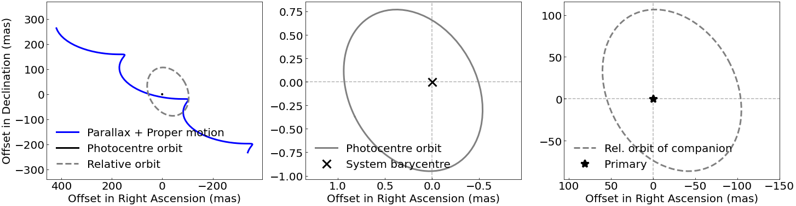
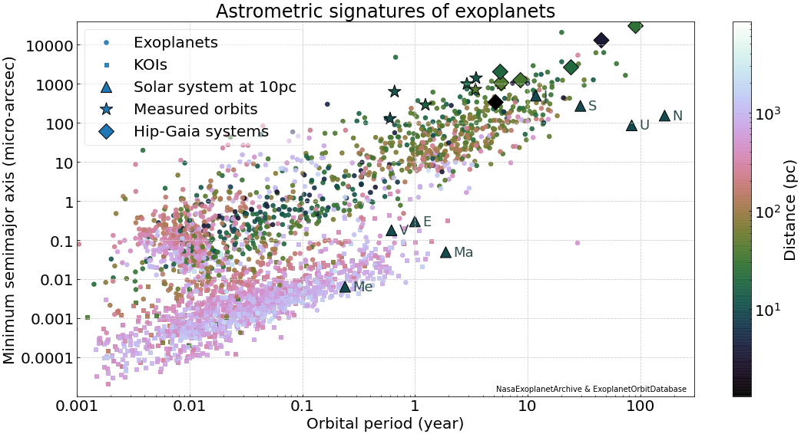

# pystrometry  -  Support for high-precision astrometry timeseries analysis

This code collection evolved over the last 10+ years and does therefore not always conform with coding 
standards and best practices, but it is installable via PyPI: `pip install pystrometry`. 

pystrometry provides a variety of functionalities and has been used in several publications. It is 
under active development.

### Example usages
- Plotting the orbital motion with default parameters   
        
        from pystrometry.pystrometry import OrbitSystem 
                
        orb = OrbitSystem()  # default parameters
        orb.plot_orbits()    
    More customised orbit plotting example from this notebook: [2_exoplanet_example_orbit.ipynb](notebooks/2_exoplanet_example_orbit.ipynb)  

  

- Define the system parameters

        from collections import OrderedDict
        attribute_dict = OrderedDict([  ('RA_deg', 164.), 
                                        ('DE_deg', -21.),
                                        ('absolute_plx_mas', 27.), 
                                        ('Tp_day', 57678.4), 
                                        ('omega_deg', -23.),
                                        ('P_day', 687.), 
                                        ('ecc', 0.08), 
                                        ('OMEGA_deg', 114.),
                                        ('i_deg', 31.), 
                                        ('m1_MS', 0.9),
                                        ('m2_MJ', 3.)])
                                        
        orb = OrbitSystem(attribute_dict)
        orb.plot_orbits() 

    Compute the proper motion displacements in RA, Dec for the system:
    
        t_mjd = np.linspace(50000, 52000)
        delta_ra_star_mas, delta_dec_mas = orb.ppm(t_mjd)

- Compute and plot the astrometric amplitudes of known exoplanets.  
The code is in this notebook: [1_exoplanet_signatures.ipynb](notebooks/1_exoplanet_signatures.ipynb)  

  

### Conda environment creation
This requires a conda installation.

Create a dedicated environment (here named `astrom`) with the necessary dependencies:

    conda create --name astrom --yes python=3.7 pandas pip==20.2.4
    
Activate that environment: 

    conda activate astrom

Install pystrometry from PyPI:

    pip install pystrometry

### Documentation

### Contributing
Please open a new issue or new pull request for bugs, feedback, or new features you would like to see. If there is an issue you would like to work on, please leave a comment and we will be happy to assist. New contributions and contributors are very welcome!   
 
### References

### Citation
If you find this package useful, please consider citing the Zenodo record using the DOI badge above.
Please find additional citation instructions in [CITATION](CITATION). 

